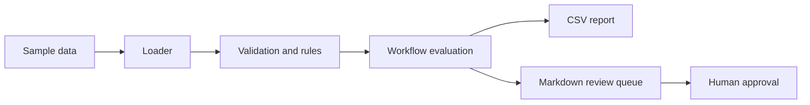

# Architecture

## Design Notes
- The demo is local-only and deterministic.
- The code is split into configuration, data models, rules, pipeline orchestration, and report writing.
- The same pattern can be moved into n8n, Make, Zapier, Google Sheets scripts, or a small API service.

## Current Focus
Routes inbound lead records through validation, scoring, routing, and human-reviewed follow-up drafts.
